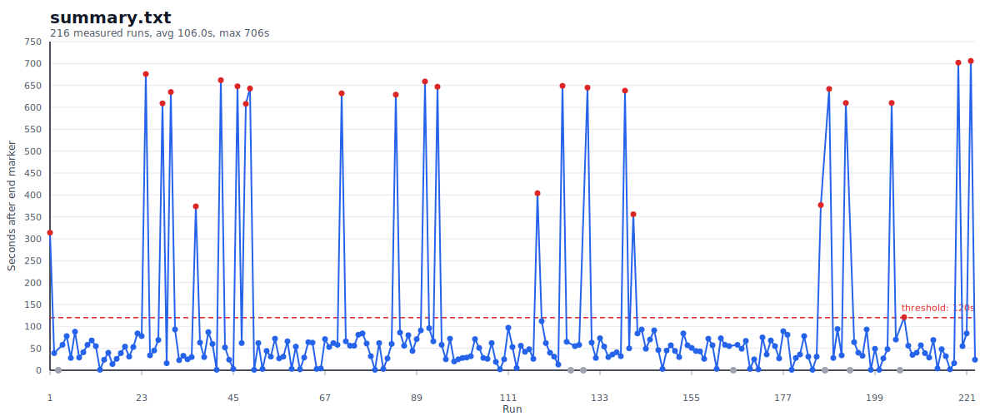

# testem-hang-demo

Minimal vanilla-JS reproduction for an intermittent Testem shutdown hang with headless Google Chrome and parallel Testem browser launches.

The target failure shape is:

- all tests finish
- the last test result is printed
- the parent Testem process stays alive for far too long instead of exiting promptly

## Status

This repo has reproduced the problem locally on macOS with installed Google Chrome and stock `testem@3.19.1`.

The investigation writeup is in [docs/investigation.md](docs/investigation.md).

## Requirements

- Node
- npm
- Google Chrome installed

## Install

```sh
git clone https://github.com/navels/testem-hang-demo.git
cd testem-hang-demo
npm install
```

## Reproduce

Run the repro once:

```sh
npm test
```

This launches 10 parallel headless Chrome instances through Testem. Each browser runs the same 50-test QUnit suite.

Because the issue is intermittent, the loop script is usually more useful:

```sh
./scripts/run-repro-loop.sh
```

The loop script:

- runs up to 100 iterations
- watches for the last expected test result line
- stops after the first run that takes more than 120 seconds to exit after that point
- writes logs under `tmp/repro-loop/`

What to expect:

- in one overnight run of 223 started iterations, 25 runs exceeded the 120-second threshold
- the first slow run happened immediately on run 1 in that sample
- the issue is intermittent, so a failure can happen quickly or after many clean runs, but this setup reproduced often enough that the loop script was useful as the primary investigation driver

Example overnight output from this repo:


